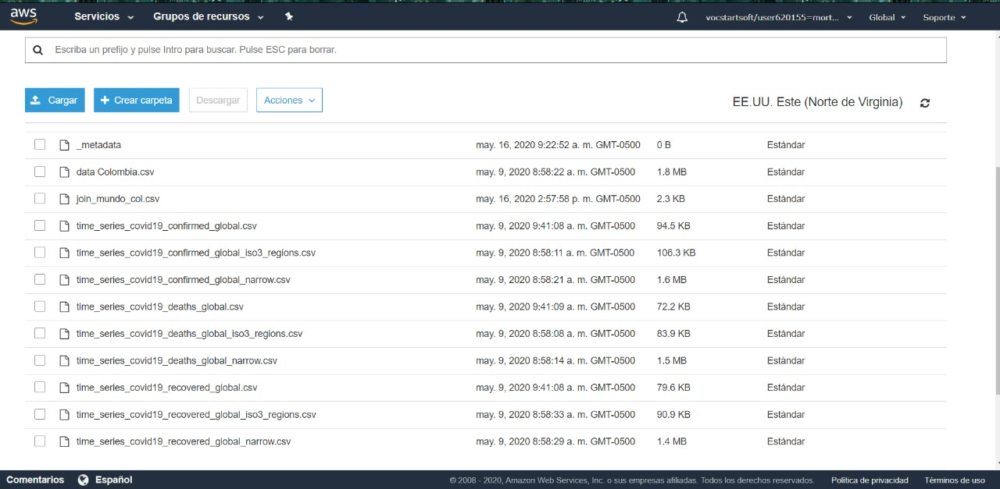

# Proyecto 3 - Telemática

El virus Sars-Cov-2 ha impactado la vida como la conocemos, y ha afectado el sector social, económico, y nuestra percepción de normalidad. Así, se convierte en un reto intentar entender este nuevo suceso desde nuestra óptica en tópicos especiales en telemática, con el ánimo de entender esta amenzante situación.
Para realizar el este entendimiento, utilizamos el ciclo de vida de los datos que se describe a continuación:

## Recolección de datos

Las fuentes principales de datos para el proyecto fueron, que provienen de Johns Hopkins School of Public Health y están en constante actualización,

A nivel mundial:

    - https://data.humdata.org/dataset/novel-coronavirus-2019-ncov-cases

    En los datos tenemos:

    - Infectados, muertos, recuperados a nivel global. (Separados geograficamente por países)

En Colombia, datos tomados de Colombia National Institute of Health:

    - https://data.humdata.org/dataset/positive-cases-of-covid-19-in-colombia

    - https://data.humdata.org/
    - https://www.ins.gov.co/Paginas/Inicio.aspx
    - https://www.who.int/data/gho

## Ingesta y almacenamiento de datos

Los datos recogidos se llevan a una landing zone que en nuestro ejercicio la simulamos como nuestra máquina, posteriormente se mudan a la zona de datos crudos en s3 que tiene la siguiente estructura de ficheros:

Despues de ejecutar el paso siguiente la estructura de ficheros en la zona de producción que será consumida por el visualizador, luce así:

## Procesamiento: Análisis exploratorio de datos con pyspark

Este análisis exploratorio puede encontrarse en el siguiente [Cuaderno](./proyecto3.ipynb), que fue ejecutado en el servicio EMR que provee AWS:

## Visualización básica de datos

El insumo que el proceso de la fase análisis exploratorio de datos genera, es almacenado en la zona de producción y de ahí es quien alimenta las siguientes visualizaciones creadas con PowerBI (importando las bases directamente del S3).

### Visualizaciones para Colombia

La primera imágen nos muestra el crecimiento exponencial de los infectados en Colombia, sin embargo, podemos observar que la mayor porpoción de infectados provienen de la capital (tiene sentido por ser uno de los terriotorios más poblados), pero el dato podría estar sesgado porque también cuentan con mayores recursos para reportar resultados de pruebas.

Contamos con :

- **9617** Infectados en colombia en la fecha de corte para la gráfica
- De los cuales **2426** se han recuperado y lamentablemente
- **436** han fallecido, además entre los infectados
- **2420** estan entre 18-50 años de edad, rezagando los otros infectados a las edades mayores que tienen más riesgo

### Visualizaciones para el Mundo

El panoráma a nivel mundial, particularmente es bastante gris para Estados Unidos e Italia, que sus cifras de infectados crecen exponencialmente, y a la velocidad que observamos probablemente el sistema de salud colapsará totalmente, y el número de muertos crecerá sin remedio.

### Visualizaciones para Colombia vs Mundo

Esta gráfica (que contiene dos ejes 'y' ) nos permite comparar el comportamiento exponencial del virus, y observamos que la escala de número de infectados en Colombia no es tan acelerada como en el mundo, lo que nos situa en un lugar estratégico para replantear las medidas que eviten encontrarnos en la posición que por desgracia viven estos otros países.

Integrantes:

    - Miguel Angel Ortiz Arboleda
    - Hassler Castro Cuesta
